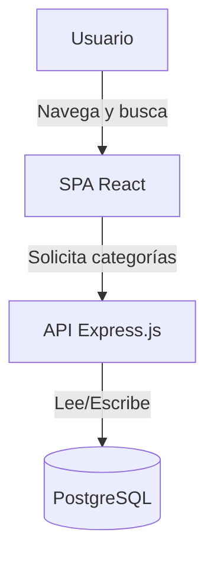
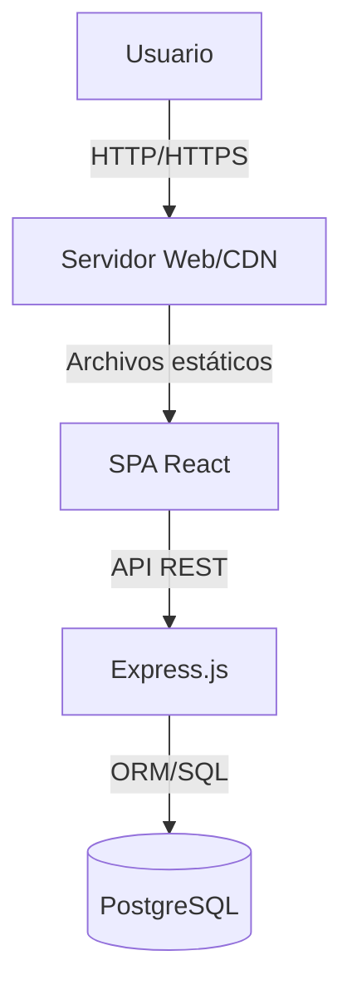
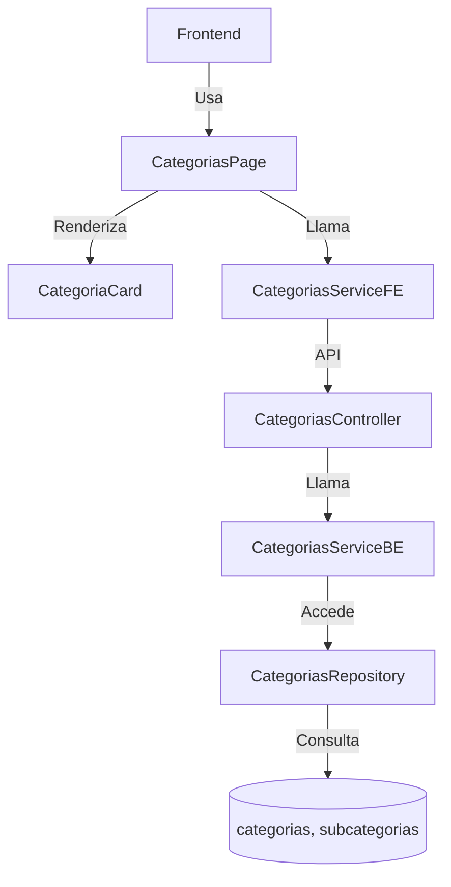
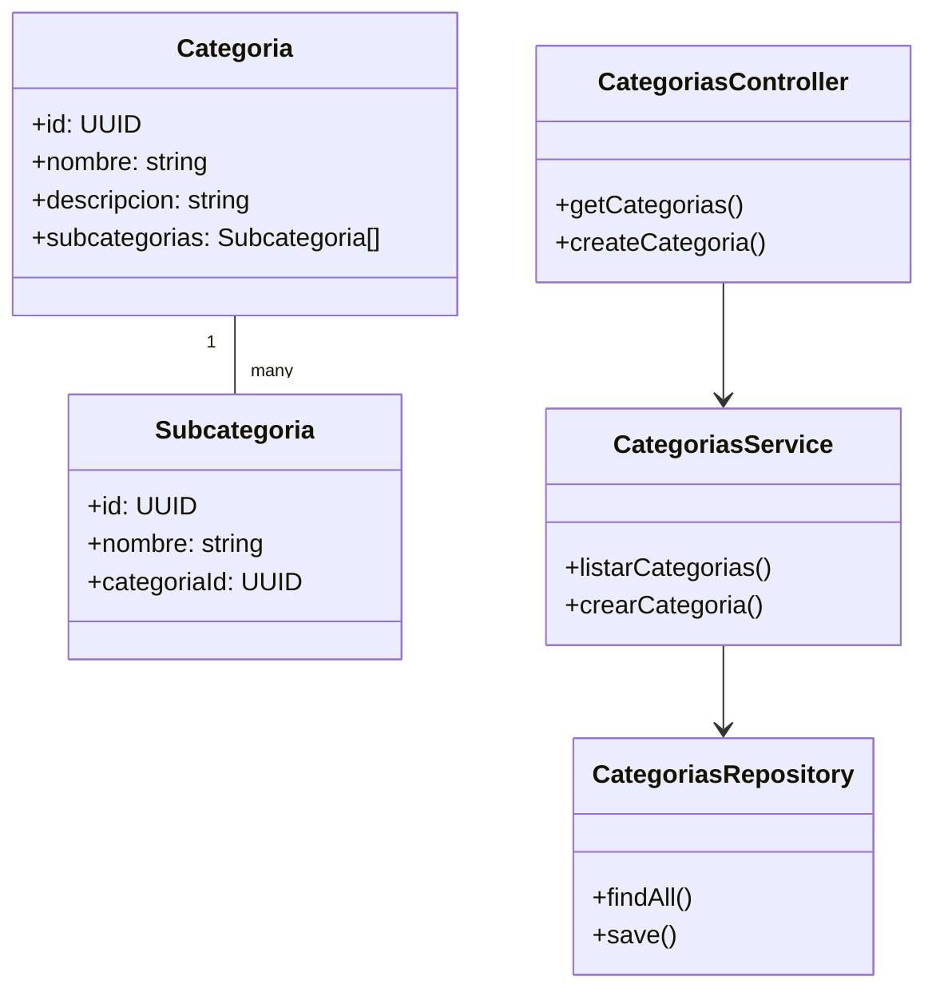
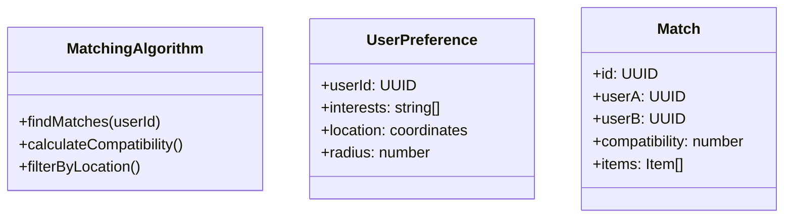
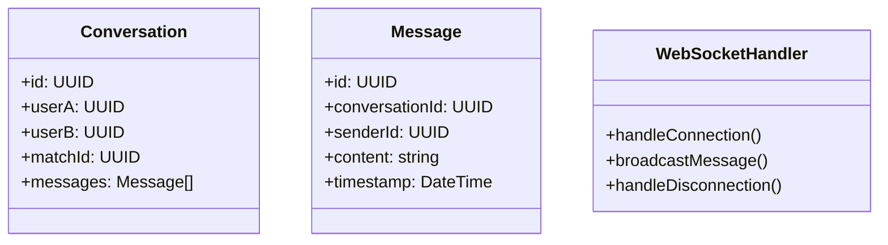
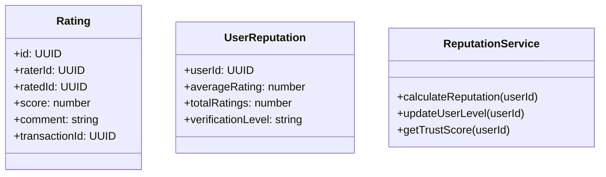

# Generar diagrama c4 para características
_Exported on 11/07/2025 at 3:58:25 CEST from Cursor (1.2.1)_

---

**User**

basandote en el diagrama mermaid @diagrama_infraestructura.md y en las catagorias esenciales definidas en @system-design.md, es necesario generar un diagrama c4 para cada caracteristica

Vamos a empzar por la primera "Categorías de productos y servicios" y define bien los 4 niveles 

---

**Cursor**

¡Perfecto! Vamos a crear el desglose de los 4 niveles del modelo C4 para la característica "Categorías de productos y servicios", basándonos en el diagrama de infraestructura y el diseño funcional.

### 1. Contexto (Nivel 1: System Context Diagram)

**Propósito:** Mostrar cómo la funcionalidad de categorías de productos y servicios se integra en el sistema global y cómo interactúan los usuarios y sistemas externos.

**Elementos principales:**
- Usuario (persona que busca/ofrece productos o servicios)
- Plataforma Truequealo (Frontend SPA + Backend API)
- Base de datos (PostgreSQL)
- Servicios externos (opcional, para futuras integraciones de catálogos)

**Descripción:**
El usuario accede a la plataforma Truequealo desde su dispositivo, navega por las categorías y subcategorías, y consulta la información almacenada en la base de datos a través de la API.

**Diagrama (pseudo-mermaid):**


---

### 2. Contenedores (Nivel 2: Container Diagram)

**Propósito:** Mostrar los principales contenedores de software implicados en la gestión de categorías.

**Elementos principales:**
- Frontend (SPA React)
- Backend (API REST Express.js)
- Base de datos (PostgreSQL)
- CDN/Servidor Web (sirve el frontend)
- Servicios de autenticación (si el acceso a categorías depende de login)

**Descripción:**
El frontend consume la API para mostrar y filtrar categorías. El backend expone endpoints para consultar, crear o modificar categorías. La base de datos almacena la estructura de categorías y subcategorías.

**Diagrama (pseudo-mermaid):**


---

### 3. Componentes (Nivel 3: Component Diagram)

**Propósito:** Detallar los componentes internos del backend y frontend relacionados con la gestión de categorías.

**Elementos principales:**
- Frontend:
  - CategoríasPage (página de exploración)
  - CategoríaCard (componente visual)
  - CategoríasService (servicio de consumo de API)
- Backend:
  - CategoríasController (gestiona endpoints)
  - CategoríasService (lógica de negocio)
  - CategoríasRepository (acceso a datos)
- Base de datos:
  - Tabla `categorias`
  - Tabla `subcategorias`

**Diagrama (pseudo-mermaid):**


---

### 4. Código (Nivel 4: Code/Classes Diagram)

**Propósito:** Mostrar la estructura de clases o módulos para la gestión de categorías.

**Ejemplo Backend (Express + ORM):**


---

## Resumen

- **Nivel 1 (Contexto):** Usuario interactúa con la plataforma para explorar categorías.
- **Nivel 2 (Contenedores):** Frontend, backend y base de datos colaboran para mostrar y gestionar categorías.
- **Nivel 3 (Componentes):** Componentes específicos en frontend y backend gestionan la lógica y visualización.
- **Nivel 4 (Código):** Clases/módulos para la gestión de categorías y subcategorías.

¿Quieres que prepare los diagramas en formato mermaid para cada nivel, o prefieres una descripción más detallada de algún nivel en particular?

```plaintext
graph TD
  User[Usuario] -->|Navega y busca| Frontend[SPA React]
  Frontend -->|Solicita categorías| Backend[API Express.js]
  Backend -->|Lee/Escribe| DB[(PostgreSQL)]
```

```plaintext
graph TD
  User[Usuario] -->|HTTP/HTTPS| Web[Servidor Web/CDN]
  Web -->|Archivos estáticos| Frontend[SPA React]
  Frontend -->|API REST| Backend[Express.js]
  Backend -->|ORM/SQL| DB[(PostgreSQL)]
```

```plaintext
graph TD
  Frontend -->|Usa| CategoriasPage
  CategoriasPage -->|Renderiza| CategoriaCard
  CategoriasPage -->|Llama| CategoriasServiceFE
  CategoriasServiceFE -->|API| CategoriasController
  CategoriasController -->|Llama| CategoriasServiceBE
  CategoriasServiceBE -->|Accede| CategoriasRepository
  CategoriasRepository -->|Consulta| DB[(categorias, subcategorias)]
```

```plaintext
classDiagram
  class Categoria {
    +id: UUID
    +nombre: string
    +descripcion: string
    +subcategorias: Subcategoria[]
  }
  class Subcategoria {
    +id: UUID
    +nombre: string
    +categoriaId: UUID
  }
  class CategoriasController {
    +getCategorias()
    +createCategoria()
  }
  class CategoriasService {
    +listarCategorias()
    +crearCategoria()
  }
  class CategoriasRepository {
    +findAll()
    +save()
  }
  Categoria "1" -- "many" Subcategoria
  CategoriasController --> CategoriasService
  CategoriasService --> CategoriasRepository
```

---

**User**

basandote en el mismo diagrama @diagrama_infraestructura.md y en las categorias esenciales definidas en @system-design.md, necesito generar los siguientes diagramas c4 para las siguientes categorias:

- Sistema de coincidencias
- Negociación y chat integrado
- Reputación y comentarios

---

**Cursor**

¡Perfecto! Vamos a crear los diagramas C4 para las tres características restantes. Te proporcionaré el desglose de los 4 niveles para cada una:

## 1. Sistema de Coincidencias (Match)

### Nivel 1: Contexto
**Propósito:** Mostrar cómo el sistema de coincidencias conecta necesidades con ofertas entre usuarios.

**Elementos principales:**
- Usuario A (busca un producto/servicio)
- Usuario B (ofrece un producto/servicio)
- Plataforma Truequealo (algoritmo de matching)
- Base de datos (perfiles, preferencias, historial)

**Descripción:**
Los usuarios interactúan con la plataforma. El sistema analiza sus necesidades y ofertas, aplicando algoritmos de coincidencia para sugerir intercambios potenciales.

### Nivel 2: Contenedores
**Elementos principales:**
- Frontend (SPA React) - interfaz de usuario
- Backend (API Express.js) - lógica de coincidencias
- Base de datos (PostgreSQL) - perfiles y preferencias
- Servicio de Geolocalización - para coincidencias por proximidad
- Servicio de Notificaciones - alertas de nuevas coincidencias

### Nivel 3: Componentes
**Frontend:**
- MatchingPage (página de coincidencias)
- MatchCard (visualización de coincidencias)
- MatchingService (consumo de API)

**Backend:**
- MatchingController (endpoints de coincidencias)
- MatchingAlgorithm (lógica de matching)
- UserPreferencesService (gestión de preferencias)
- MatchingRepository (acceso a datos)

### Nivel 4: Código


---

## 2. Negociación y Chat Integrado

### Nivel 1: Contexto
**Propósito:** Mostrar cómo los usuarios negocian y se comunican directamente para acordar intercambios.

**Elementos principales:**
- Usuario A y Usuario B (negociadores)
- Plataforma Truequealo (canal de comunicación)
- Servicio de Chat (mensajería en tiempo real)

**Descripción:**
Los usuarios establecen comunicación directa a través de la plataforma para discutir condiciones, detalles y acordar el intercambio.

### Nivel 2: Contenedores
**Elementos principales:**
- Frontend (SPA React) - interfaz de chat
- Backend (API Express.js) - gestión de conversaciones
- WebSocket Server - comunicación en tiempo real
- Base de datos (PostgreSQL) - historial de mensajes
- Servicio de Notificaciones - alertas de nuevos mensajes

### Nivel 3: Componentes
**Frontend:**
- ChatPage (página de conversación)
- MessageList (lista de mensajes)
- MessageInput (entrada de mensajes)
- ChatService (gestión de WebSocket)

**Backend:**
- ChatController (endpoints de chat)
- WebSocketHandler (gestión de conexiones)
- MessageService (lógica de mensajería)
- ChatRepository (persistencia de mensajes)

### Nivel 4: Código


---

## 3. Reputación y Comentarios

### Nivel 1: Contexto
**Propósito:** Mostrar cómo los usuarios evalúan y construyen confianza mutua a través de calificaciones y comentarios.

**Elementos principales:**
- Usuario A (evalúa a Usuario B)
- Usuario B (recibe evaluación)
- Plataforma Truequealo (sistema de reputación)
- Base de datos (calificaciones y comentarios)

**Descripción:**
Después de un intercambio, los usuarios pueden calificarse mutuamente y dejar comentarios, contribuyendo al sistema de reputación de la plataforma.

### Nivel 2: Contenedores
**Elementos principales:**
- Frontend (SPA React) - interfaz de calificaciones
- Backend (API Express.js) - lógica de reputación
- Base de datos (PostgreSQL) - calificaciones y comentarios
- Servicio de Moderación - revisión de comentarios inapropiados
- Servicio de Notificaciones - alertas de nuevas evaluaciones

### Nivel 3: Componentes
**Frontend:**
- RatingPage (página de calificación)
- RatingForm (formulario de evaluación)
- UserProfile (perfil con reputación)
- RatingService (consumo de API)

**Backend:**
- RatingController (endpoints de calificaciones)
- ReputationService (cálculo de reputación)
- ModerationService (filtrado de contenido)
- RatingRepository (persistencia de evaluaciones)

### Nivel 4: Código


---

## Resumen de Integración

Todos estos sistemas se integran en la arquitectura general definida en el diagrama de infraestructura:

1. **Sistema de Coincidencias** utiliza geolocalización y notificaciones
2. **Chat Integrado** requiere WebSocket para tiempo real
3. **Reputación** se conecta con moderación y seguridad

¿Te gustaría que profundice en algún nivel específico o que genere los diagramas mermaid completos para alguna de estas características?

```plaintext
classDiagram
  class MatchingAlgorithm {
    +findMatches(userId)
    +calculateCompatibility()
    +filterByLocation()
  }
  class UserPreference {
    +userId: UUID
    +interests: string[]
    +location: coordinates
    +radius: number
  }
  class Match {
    +id: UUID
    +userA: UUID
    +userB: UUID
    +compatibility: number
    +items: Item[]
  }
```

```plaintext
classDiagram
  class Conversation {
    +id: UUID
    +userA: UUID
    +userB: UUID
    +matchId: UUID
    +messages: Message[]
  }
  class Message {
    +id: UUID
    +conversationId: UUID
    +senderId: UUID
    +content: string
    +timestamp: DateTime
  }
  class WebSocketHandler {
    +handleConnection()
    +broadcastMessage()
    +handleDisconnection()
  }
```

```plaintext
classDiagram
  class Rating {
    +id: UUID
    +raterId: UUID
    +ratedId: UUID
    +score: number
    +comment: string
    +transactionId: UUID
  }
  class UserReputation {
    +userId: UUID
    +averageRating: number
    +totalRatings: number
    +verificationLevel: string
  }
  class ReputationService {
    +calculateReputation(userId)
    +updateUserLevel(userId)
    +getTrustScore(userId)
  }
```

