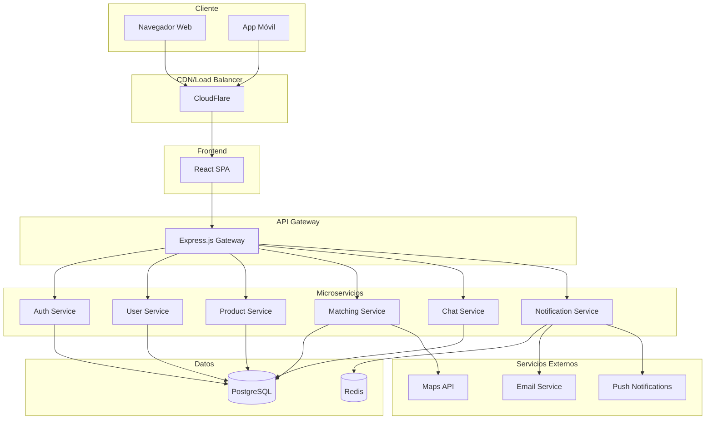

# Documento de Requisitos del Producto (PRD) - TruequeAlo

**Versión:** 1.0  
**Fecha:** Enero 2025  
**Autor:** Francisco Javier García  
**Revisado por:** Equipo de Producto

---

## 1. Introducción y Objetivos

### 1.1 Resumen Ejecutivo

**TruequeAlo** es una plataforma digital innovadora diseñada para facilitar el intercambio directo de bienes y servicios entre personas, eliminando la necesidad de dinero y promoviendo una economía circular, sostenible y colaborativa. La plataforma utiliza tecnología avanzada de matching, sistemas de reputación y geolocalización para crear un ecosistema de confianza que revive el trueque tradicional adaptado a la era digital.

### 1.2 Propósito del Producto

TruequeAlo surge para resolver la creciente necesidad de alternativas económicas sostenibles y locales, especialmente relevante en contextos de:

- Recursos económicos limitados
- Búsqueda de consumo responsable
- Fortalecimiento de comunidades locales
- Reducción del desperdicio y promoción de la economía circular

### 1.3 Objetivos Principales

#### Objetivos de Negocio

- **Facilitar 10,000+ intercambios exitosos** en el primer año
- **Alcanzar 50,000 usuarios activos** en 18 meses
- **Lograr una tasa de satisfacción del 85%+** en intercambios completados
- **Establecer presencia en 5+ ciudades principales** para el segundo año

#### Objetivos de Usuario

- Proporcionar una experiencia de trueque **intuitiva y segura**
- Conectar ofertas y necesidades con **precisión del 80%+** en matching
- Construir **confianza y comunidad** a través de sistemas de reputación
- Promover **intercambios locales** para fortalecer economías de proximidad

#### Objetivos Técnicos

- Mantener **99.5% de uptime** de la plataforma
- Lograr **tiempo de respuesta <2 segundos** en búsquedas y matching
- Asegurar **escalabilidad** para 100,000+ usuarios concurrentes
- Implementar **seguridad de nivel empresarial** en todas las transacciones

### 1.4 Metas Estratégicas

1. **Sostenibilidad Ambiental**: Reducir el desperdicio promoviendo la reutilización
2. **Inclusión Social**: Crear oportunidades económicas para todos los niveles socioeconómicos
3. **Innovación Tecnológica**: Liderar en algoritmos de matching y experiencia de usuario
4. **Crecimiento Orgánico**: Construir una comunidad auto-sostenible y comprometida

---

## 2. Stakeholders

### 2.1 Stakeholders Primarios

#### **Usuarios Finales**

- **Intercambiadores Activos**: Personas que regularmente ofrecen y buscan intercambios
- **Nuevos Usuarios**: Personas interesadas en probar el trueque por primera vez
- **Usuarios Premium**: Aquellos que pagan por funcionalidades avanzadas

#### **Equipo de Desarrollo**

- **Product Manager**: Definición de roadmap y prioridades
- **Desarrolladores Frontend/Backend**: Implementación técnica
- **Diseñadores UX/UI**: Experiencia de usuario y interfaz
- **QA Engineers**: Calidad y testing

### 2.2 Stakeholders Secundarios

#### **Equipo de Negocio**

- **Marketing y Crecimiento**: Adquisición y retención de usuarios
- **Atención al Cliente**: Soporte y resolución de problemas
- **Community Managers**: Gestión de comunidad y moderación
- **Analistas de Datos**: Métricas y optimización

#### **Socios Externos**

- **Proveedores de Servicios de Pago**: Para suscripciones premium
- **Servicios de Mapas**: Google Maps, OpenStreetMap
- **Proveedores de Notificaciones**: Push notifications, email, SMS
- **Servicios de Verificación**: Verificación de identidad
- **Proveedores de Cloud**: AWS, Google Cloud, Azure

### 2.3 Stakeholders Regulatorios

#### **Entidades Reguladoras**

- **Autoridades de Protección de Datos**: GDPR, CCPA compliance
- **Reguladores de Comercio Electrónico**: Normativas locales de intercambio
- **Autoridades Fiscales**: Implicaciones tributarias del trueque

#### **Organizaciones de la Industria**

- **Asociaciones de Economía Circular**: Colaboración en sostenibilidad
- **ONGs Locales**: Programas de inclusión social
- **Cámaras de Comercio**: Promoción de economía local

### 2.4 Matriz de Influencia-Interés

| Stakeholder          | Influencia | Interés | Estrategia          |
| -------------------- | ---------- | ------- | ------------------- |
| Usuarios Finales     | Alta       | Alta    | Gestionar de cerca  |
| Equipo de Desarrollo | Alta       | Alta    | Gestionar de cerca  |
| Marketing            | Media      | Alta    | Mantener satisfecho |
| Reguladores          | Alta       | Media   | Mantener informado  |
| Socios Técnicos      | Media      | Media   | Monitorear          |

---

## 3. Historias de Usuarios

### 3.1 Épicas Principales

#### **Épica 1: Descubrimiento y Búsqueda**

_Como usuario, quiero encontrar fácilmente productos y servicios que me interesen para poder realizar intercambios valiosos._

#### **Épica 2: Matching y Conexión**

_Como usuario, quiero que el sistema me sugiera intercambios relevantes para maximizar mis oportunidades de trueque._

#### **Épica 3: Comunicación y Negociación**

_Como usuario, quiero comunicarme de forma segura con otros usuarios para negociar los términos del intercambio._

#### **Épica 4: Confianza y Reputación**

_Como usuario, quiero evaluar la confiabilidad de otros usuarios para realizar intercambios seguros._

### 3.2 Historias de Usuario Detalladas

#### **HU-001: Registro y Perfil**

**Como** nuevo usuario  
**Quiero** crear mi perfil de manera rápida y sencilla  
**Para** comenzar a usar la plataforma inmediatamente

**Criterios de Aceptación:**

- Registro en menos de 2 minutos
- Verificación por email
- Subida de foto de perfil opcional
- Configuración de ubicación y radio de búsqueda

---

#### **HU-002: Publicar Oferta**

**Como** usuario registrado  
**Quiero** publicar productos o servicios que ofrezco  
**Para** que otros usuarios puedan encontrarlos e intercambiar

**Criterios de Aceptación:**

- Formulario intuitivo con categorías predefinidas
- Subida de hasta 5 fotos
- Descripción detallada y condiciones
- Configuración de preferencias de intercambio

---

#### **HU-003: Búsqueda y Filtrado**

**Como** usuario  
**Quiero** buscar productos/servicios específicos con filtros avanzados  
**Para** encontrar exactamente lo que necesito

**Criterios de Aceptación:**

- Búsqueda por texto, categoría y ubicación
- Filtros por distancia, fecha, calificación
- Resultados ordenados por relevancia
- Guardado de búsquedas favoritas

---

#### **HU-004: Sistema de Matching**

**Como** usuario  
**Quiero** recibir sugerencias personalizadas de intercambios  
**Para** descubrir oportunidades que no había considerado

**Criterios de Aceptación:**

- Algoritmo basado en historial y preferencias
- Notificaciones de nuevos matches
- Puntuación de compatibilidad visible
- Actualización diaria de sugerencias

---

#### **HU-005: Chat y Negociación**

**Como** usuario interesado en un intercambio  
**Quiero** comunicarme directamente con el otro usuario  
**Para** negociar términos y acordar detalles

**Criterios de Aceptación:**

- Chat en tiempo real
- Historial de conversaciones
- Notificaciones push de nuevos mensajes
- Opción de compartir ubicación para encuentro

---

#### **HU-006: Confirmar Intercambio**

**Como** usuario  
**Quiero** marcar un intercambio como completado  
**Para** actualizar mi historial y poder calificar al otro usuario

**Criterios de Aceptación:**

- Confirmación mutua requerida
- Registro en historial de transacciones
- Trigger para sistema de calificaciones
- Actualización de estadísticas de usuario

---

#### **HU-007: Sistema de Calificaciones**

**Como** usuario que completó un intercambio  
**Quiero** calificar mi experiencia con el otro usuario  
**Para** contribuir al sistema de confianza de la plataforma

**Criterios de Aceptación:**

- Calificación de 1-5 estrellas
- Comentario opcional
- Categorías de evaluación (puntualidad, estado del producto, comunicación)
- Visibilidad en perfil del usuario calificado

---

#### **HU-008: Perfil de Reputación**

**Como** usuario  
**Quiero** ver la reputación y historial de otros usuarios  
**Para** tomar decisiones informadas sobre intercambios

**Criterios de Aceptación:**

- Calificación promedio visible
- Número total de intercambios
- Comentarios recientes
- Insignias de verificación y logros

---

#### **HU-009: Geolocalización**

**Como** usuario  
**Quiero** ver ofertas cercanas en un mapa  
**Para** priorizar intercambios locales y convenientes

**Criterios de Aceptación:**

- Mapa interactivo con pins de ofertas
- Filtro por radio de distancia
- Indicación de distancia exacta
- Integración con GPS del dispositivo

---

#### **HU-010: Notificaciones**

**Como** usuario  
**Quiero** recibir notificaciones relevantes  
**Para** no perder oportunidades de intercambio

**Criterios de Aceptación:**

- Notificaciones push configurables
- Alertas de nuevos matches
- Mensajes de chat
- Recordatorios de intercambios pendientes

### 3.3 Personas de Usuario

#### **Persona 1: María, la Madre Consciente**

- **Edad:** 35 años
- **Ocupación:** Madre de familia, trabajo de medio tiempo
- **Motivación:** Ahorrar dinero y enseñar sostenibilidad a sus hijos
- **Necesidades:** Ropa infantil, juguetes, artículos del hogar
- **Ofertas:** Ropa que ya no usa, productos caseros
- **Tecnología:** Usuario intermedio, principalmente móvil

#### **Persona 2: Carlos, el Estudiante Universitario**

- **Edad:** 22 años
- **Ocupación:** Estudiante de ingeniería
- **Motivación:** Maximizar recursos limitados, conocer gente
- **Necesidades:** Libros, electrónicos, servicios (tutorías)
- **Ofertas:** Servicios técnicos, productos de tecnología
- **Tecnología:** Usuario avanzado, multiplataforma

#### **Persona 3: Ana, la Emprendedora Sostenible**

- **Edad:** 28 años
- **Ocupación:** Pequeña empresaria, productos eco-friendly
- **Motivación:** Promover economía circular, networking
- **Necesidades:** Servicios profesionales, materiales para negocio
- **Ofertas:** Productos artesanales, consultoría
- **Tecnología:** Usuario avanzado, enfoque en móvil

---

## 4. Componentes Principales y Sitemaps

### 4.1 Arquitectura de Información

#### **Sitemap Principal**

```
TruequeAlo/
├── Autenticación/
│   ├── Registro
│   ├── Login
│   └── Recuperar Contraseña
├── Dashboard/
│   ├── Feed Principal
│   ├── Mis Matches
│   ├── Mensajes Recientes
│   └── Actividad
├── Explorar/
│   ├── Búsqueda Avanzada
│   ├── Categorías
│   ├── Mapa de Ofertas
│   └── Trending
├── Mis Intercambios/
│   ├── Mis Ofertas
│   ├── Mis Búsquedas
│   ├── En Proceso
│   └── Historial
├── Mensajes/
│   ├── Lista de Conversaciones
│   ├── Chat Individual
│   └── Archivo
├── Perfil/
│   ├── Mi Perfil
│   ├── Configuración
│   ├── Reputación
│   └── Verificaciones
└── Ayuda/
    ├── Tutorial
    ├── FAQ
    ├── Soporte
    └── Términos y Condiciones
```

### 4.2 Componentes Técnicos Principales

#### **Frontend (React SPA)**

##### **Componentes de Navegación**

- `<Header>` - Barra de navegación principal
- `<Sidebar>` - Menú lateral (móvil)
- `<TabBar>` - Navegación inferior (móvil)
- `<Breadcrumb>` - Navegación contextual

##### **Componentes de Contenido**

- `<FeedCard>` - Tarjeta de oferta en feed
- `<ProductCard>` - Detalle de producto/servicio
- `<UserCard>` - Información de usuario
- `<MatchCard>` - Visualización de coincidencia

##### **Componentes de Interacción**

- `<SearchBar>` - Barra de búsqueda avanzada
- `<FilterPanel>` - Panel de filtros
- `<ChatInterface>` - Interfaz de mensajería
- `<RatingComponent>` - Sistema de calificaciones

##### **Componentes de Formulario**

- `<ProductForm>` - Crear/editar oferta
- `<ProfileForm>` - Editar perfil
- `<SearchForm>` - Formulario de búsqueda
- `<ReportForm>` - Reportar contenido

#### **Backend (Express.js API)**

##### **Controladores Principales**

- `AuthController` - Autenticación y autorización
- `UserController` - Gestión de usuarios y perfiles
- `ProductController` - CRUD de productos/servicios
- `MatchingController` - Algoritmo de coincidencias
- `ChatController` - Sistema de mensajería
- `RatingController` - Sistema de calificaciones

##### **Servicios de Negocio**

- `MatchingService` - Lógica de matching
- `NotificationService` - Gestión de notificaciones
- `GeolocationService` - Servicios de ubicación
- `ModerationService` - Moderación de contenido
- `ReputationService` - Cálculo de reputación

##### **Repositorios de Datos**

- `UserRepository` - Acceso a datos de usuarios
- `ProductRepository` - Acceso a datos de productos
- `ConversationRepository` - Gestión de conversaciones
- `TransactionRepository` - Historial de intercambios

### 4.3 Flujos de Usuario Principales

#### **Flujo 1: Primer Uso**

1. **Landing Page** → Registro/Login
2. **Onboarding** → Tutorial interactivo
3. **Configuración de Perfil** → Ubicación y preferencias
4. **Primera Búsqueda** → Explorar categorías
5. **Primera Oferta** → Publicar producto/servicio

#### **Flujo 2: Búsqueda y Match**

1. **Dashboard** → Ver sugerencias personalizadas
2. **Búsqueda** → Filtrar por criterios específicos
3. **Explorar Resultados** → Ver detalles de ofertas
4. **Expresar Interés** → Iniciar conversación
5. **Negociar** → Chat y acuerdo de términos

#### **Flujo 3: Intercambio Completo**

1. **Acuerdo** → Confirmar términos y ubicación
2. **Encuentro** → Realizar intercambio físico
3. **Confirmación** → Marcar como completado
4. **Calificación** → Evaluar experiencia
5. **Historial** → Registro en perfil

---

## 5. Requisitos Técnicos

### 5.1 Arquitectura del Sistema

#### **Patrón Arquitectónico**

- **Arquitectura:** Microservicios con API Gateway
- **Frontend:** Single Page Application (SPA) con React
- **Backend:** API REST con Node.js/Express.js
- **Base de Datos:** PostgreSQL (principal) + Redis (cache)
- **Comunicación:** HTTP/HTTPS + WebSockets para chat

#### **Diagrama de Arquitectura**



### 5.2 Especificaciones Técnicas

#### **Frontend Requirements**

##### **Tecnologías Core**

- **Framework:** React 18+ con TypeScript
- **Estado:** Redux Toolkit + RTK Query
- **Routing:** React Router v6
- **UI Framework:** Material-UI v5 o Tailwind CSS
- **Maps:** Google Maps API o Mapbox

##### **Características Técnicas**

- **PWA:** Progressive Web App con service workers
- **Responsive:** Mobile-first design (320px - 1920px)
- **Accesibilidad:** WCAG 2.1 AA compliance
- **Internacionalización:** i18next para múltiples idiomas
- **SEO:** Server-side rendering para páginas públicas

##### **Performance Requirements**

- **First Contentful Paint:** < 1.5 segundos
- **Largest Contentful Paint:** < 2.5 segundos
- **Time to Interactive:** < 3 segundos
- **Bundle Size:** < 500KB gzipped inicial

#### **Backend Requirements**

##### **Tecnologías Core**

- **Runtime:** Node.js 18+ LTS
- **Framework:** Express.js 4+
- **Database ORM:** Prisma o TypeORM
- **Authentication:** JWT + OAuth 2.0
- **Real-time:** Socket.io para chat

##### **APIs y Integraciones**

- **RESTful API:** OpenAPI 3.0 specification
- **GraphQL:** Opcional para queries complejas
- **WebSocket:** Para chat en tiempo real
- **File Upload:** Multer + AWS S3/CloudFlare R2
- **Rate Limiting:** Express-rate-limit

##### **Performance Requirements**

- **Response Time:** < 200ms para queries simples
- **Throughput:** 1000+ requests/segundo
- **Concurrent Users:** 10,000+ simultáneos
- **Database Queries:** < 100ms promedio

#### **Base de Datos**

##### **Esquema Principal (PostgreSQL)**

```sql
-- Usuarios
CREATE TABLE users (
    id UUID PRIMARY KEY DEFAULT gen_random_uuid(),
    email VARCHAR(255) UNIQUE NOT NULL,
    username VARCHAR(50) UNIQUE NOT NULL,
    password_hash VARCHAR(255) NOT NULL,
    first_name VARCHAR(100) NOT NULL,
    last_name VARCHAR(100) NOT NULL,
    avatar_url TEXT,
    phone VARCHAR(20),
    location POINT,
    radius INTEGER DEFAULT 10,
    verification_level INTEGER DEFAULT 0,
    reputation_score DECIMAL(3,2) DEFAULT 0.00,
    total_ratings INTEGER DEFAULT 0,
    created_at TIMESTAMP DEFAULT NOW(),
    updated_at TIMESTAMP DEFAULT NOW()
);

-- Categorías
CREATE TABLE categories (
    id UUID PRIMARY KEY DEFAULT gen_random_uuid(),
    name VARCHAR(100) NOT NULL,
    slug VARCHAR(100) UNIQUE NOT NULL,
    description TEXT,
    icon_url TEXT,
    parent_id UUID REFERENCES categories(id),
    created_at TIMESTAMP DEFAULT NOW()
);

-- Productos/Servicios
CREATE TABLE products (
    id UUID PRIMARY KEY DEFAULT gen_random_uuid(),
    user_id UUID NOT NULL REFERENCES users(id),
    category_id UUID NOT NULL REFERENCES categories(id),
    title VARCHAR(200) NOT NULL,
    description TEXT NOT NULL,
    images TEXT[], -- Array de URLs
    condition VARCHAR(20) CHECK (condition IN ('new', 'like_new', 'good', 'fair', 'poor')),
    type VARCHAR(20) CHECK (type IN ('product', 'service')) NOT NULL,
    location POINT,
    status VARCHAR(20) DEFAULT 'active' CHECK (status IN ('active', 'paused', 'completed', 'deleted')),
    wants TEXT[], -- Array de strings describiendo qué busca a cambio
    created_at TIMESTAMP DEFAULT NOW(),
    updated_at TIMESTAMP DEFAULT NOW()
);

-- Matches/Coincidencias
CREATE TABLE matches (
    id UUID PRIMARY KEY DEFAULT gen_random_uuid(),
    user_a_id UUID NOT NULL REFERENCES users(id),
    user_b_id UUID NOT NULL REFERENCES users(id),
    product_a_id UUID NOT NULL REFERENCES products(id),
    product_b_id UUID REFERENCES products(id),
    compatibility_score DECIMAL(3,2),
    status VARCHAR(20) DEFAULT 'pending' CHECK (status IN ('pending', 'accepted', 'rejected', 'completed')),
    created_at TIMESTAMP DEFAULT NOW(),
    updated_at TIMESTAMP DEFAULT NOW()
);

-- Conversaciones
CREATE TABLE conversations (
    id UUID PRIMARY KEY DEFAULT gen_random_uuid(),
    match_id UUID NOT NULL REFERENCES matches(id),
    user_a_id UUID NOT NULL REFERENCES users(id),
    user_b_id UUID NOT NULL REFERENCES users(id),
    last_message_at TIMESTAMP DEFAULT NOW(),
    created_at TIMESTAMP DEFAULT NOW()
);

-- Mensajes
CREATE TABLE messages (
    id UUID PRIMARY KEY DEFAULT gen_random_uuid(),
    conversation_id UUID NOT NULL REFERENCES conversations(id),
    sender_id UUID NOT NULL REFERENCES users(id),
    content TEXT NOT NULL,
    message_type VARCHAR(20) DEFAULT 'text' CHECK (message_type IN ('text', 'image', 'location')),
    read_at TIMESTAMP,
    created_at TIMESTAMP DEFAULT NOW()
);

-- Calificaciones
CREATE TABLE ratings (
    id UUID PRIMARY KEY DEFAULT gen_random_uuid(),
    match_id UUID NOT NULL REFERENCES matches(id),
    rater_id UUID NOT NULL REFERENCES users(id),
    rated_id UUID NOT NULL REFERENCES users(id),
    score INTEGER CHECK (score >= 1 AND score <= 5),
    comment TEXT,
    punctuality_score INTEGER CHECK (punctuality_score >= 1 AND punctuality_score <= 5),
    communication_score INTEGER CHECK (communication_score >= 1 AND communication_score <= 5),
    product_condition_score INTEGER CHECK (product_condition_score >= 1 AND product_condition_score <= 5),
    created_at TIMESTAMP DEFAULT NOW()
);
```

##### **Índices de Performance**

```sql
-- Índices geoespaciales
CREATE INDEX idx_users_location ON users USING GIST (location);
CREATE INDEX idx_products_location ON products USING GIST (location);

-- Índices de búsqueda
CREATE INDEX idx_products_search ON products USING GIN (to_tsvector('spanish', title || ' ' || description));
CREATE INDEX idx_products_category ON products(category_id);
CREATE INDEX idx_products_user ON products(user_id);
CREATE INDEX idx_products_status ON products(status);

-- Índices de relaciones
CREATE INDEX idx_matches_users ON matches(user_a_id, user_b_id);
CREATE INDEX idx_conversations_users ON conversations(user_a_id, user_b_id);
CREATE INDEX idx_messages_conversation ON messages(conversation_id);
CREATE INDEX idx_ratings_user ON ratings(rated_id);
```

### 5.3 Requisitos de Infraestructura

#### **Hosting y Deployment**

##### **Ambiente de Producción**

- **Cloud Provider:** AWS, Google Cloud, o Azure
- **Container:** Docker + Kubernetes
- **CDN:** CloudFlare o AWS CloudFront
- **Load Balancer:** Application Load Balancer
- **SSL:** Let's Encrypt o certificado comercial

##### **Especificaciones de Servidor**

```yaml
# Producción
frontend:
  instances: 2
  cpu: 1 vCPU
  memory: 2GB RAM
  storage: 20GB SSD

backend:
  instances: 3
  cpu: 2 vCPU
  memory: 4GB RAM
  storage: 50GB SSD

database:
  type: PostgreSQL managed service
  cpu: 4 vCPU
  memory: 16GB RAM
  storage: 500GB SSD
  backup: Daily automated

redis:
  type: Redis managed service
  memory: 2GB RAM
  persistence: enabled
```

#### **Seguridad**

##### **Autenticación y Autorización**

- **JWT Tokens:** Access (15min) + Refresh (7 días)
- **OAuth 2.0:** Google, Facebook, Apple login
- **2FA:** Opcional vía SMS o authenticator app
- **Rate Limiting:** 100 requests/min por IP

##### **Protección de Datos**

- **Encryption:** TLS 1.3 en tránsito, AES-256 en reposo
- **GDPR Compliance:** Right to be forgotten, data portability
- **PII Protection:** Hashing de datos sensibles
- **Backup:** Encrypted backups, 30 días retention

##### **Monitoreo y Logging**

- **APM:** New Relic, DataDog, o similar
- **Logging:** Structured logs con ELK stack
- **Alerts:** Uptime, performance, errores críticos
- **Metrics:** Custom business metrics dashboard

### 5.4 Requisitos de Integración

#### **APIs Externas Requeridas**

##### **Geolocalización**

- **Google Maps API:** $200/mes de crédito gratuito
- **Geocoding:** Conversión dirección ↔ coordenadas
- **Distance Matrix:** Cálculo de distancias
- **Places API:** Autocompletado de direcciones

##### **Notificaciones**

- **Push Notifications:** Firebase Cloud Messaging (gratuito)
- **Email:** SendGrid o AWS SES ($10-50/mes)
- **SMS:** Twilio ($0.0075 por SMS)

##### **Almacenamiento de Archivos**

- **Images:** AWS S3 o CloudFlare R2
- **CDN:** CloudFlare (gratuito hasta 100GB)
- **Image Processing:** CloudFlare Images o AWS Lambda

##### **Verificación de Identidad**

- **Phone Verification:** Twilio Verify
- **Document Verification:** Jumio o Onfido (opcional)
- **Social Login:** OAuth providers

### 5.5 Requisitos de Performance

#### **Métricas Objetivo**

##### **Frontend Performance**

- **Time to First Byte (TTFB):** < 200ms
- **First Contentful Paint:** < 1.5s
- **Largest Contentful Paint:** < 2.5s
- **Cumulative Layout Shift:** < 0.1
- **First Input Delay:** < 100ms

##### **Backend Performance**

- **API Response Time:**
  - GET endpoints: < 200ms (p95)
  - POST endpoints: < 500ms (p95)
  - Search queries: < 1s (p95)
- **Database Query Time:** < 100ms promedio
- **Throughput:** 1000+ RPS sostenido

##### **Escalabilidad**

- **Concurrent Users:** 10,000+
- **Daily Active Users:** 50,000+
- **Database Size:** 100GB+ con performance estable
- **File Storage:** 1TB+ de imágenes

#### **Estrategias de Optimización**

##### **Frontend**

- **Code Splitting:** Lazy loading por rutas
- **Image Optimization:** WebP, lazy loading, responsive images
- **Caching:** Service worker para assets estáticos
- **Bundle Optimization:** Tree shaking, minificación

##### **Backend**

- **Database Optimization:** Query optimization, índices apropiados
- **Caching:** Redis para datos frecuentes (usuarios, categorías)
- **Connection Pooling:** Optimización de conexiones DB
- **Background Jobs:** Queue para tareas pesadas

---

## 6. Planificación del Proyecto

### 6.1 Metodología de Desarrollo

#### **Marco de Trabajo**

- **Metodología:** Scrum con sprints de 2 semanas
- **Ceremonias:** Daily standups, sprint planning, retrospectives
- **Herramientas:** Jira/Linear para gestión, GitHub para código
- **Definition of Done:** Código revisado, testing, documentación actualizada

#### **Equipo de Desarrollo**

```
Product Team (5 personas):
├── Product Manager (1) - Roadmap y prioridades
├── Frontend Developers (2) - React/TypeScript
├── Backend Developer (1) - Node.js/PostgreSQL
└── QA Engineer (1) - Testing y calidad

Support Team (3 personas):
├── UX/UI Designer (1) - Diseño y experiencia
├── DevOps Engineer (0.5) - Infraestructura
└── Data Analyst (0.5) - Métricas y optimización
```

### 6.2 Roadmap de Desarrollo

#### **Fase 1: MVP Core (Meses 1-3)**

##### **Sprint 1-2: Fundaciones (4 semanas)**

- **Semana 1-2:**

  - Setup de infraestructura y CI/CD
  - Diseño de base de datos y APIs
  - Configuración de entornos (dev/staging/prod)
  - Prototipo de diseño UI/UX

- **Semana 3-4:**
  - Autenticación y registro de usuarios
  - CRUD básico de usuarios y perfiles
  - Setup de testing framework
  - Documentación de APIs (OpenAPI)

**Entregables:**

- [ ] Infraestructura desplegada
- [ ] Sistema de autenticación funcional
- [ ] Documentación técnica inicial

##### **Sprint 3-4: Productos y Búsqueda (4 semanas)**

- **Semana 5-6:**

  - CRUD de productos/servicios
  - Sistema de categorías
  - Subida y gestión de imágenes
  - Búsqueda básica por texto

- **Semana 7-8:**
  - Filtros avanzados (categoría, ubicación, distancia)
  - Geolocalización básica
  - Paginación y ordenamiento
  - Mobile-responsive design

**Entregables:**

- [ ] Gestión completa de productos
- [ ] Búsqueda y filtrado funcional
- [ ] Interfaz móvil optimizada

##### **Sprint 5-6: Matching y Chat (4 semanas)**

- **Semana 9-10:**

  - Algoritmo básico de matching
  - Sistema de "me interesa" y conexiones
  - Chat en tiempo real (WebSocket)
  - Notificaciones push básicas

- **Semana 11-12:**
  - Mejoras en algoritmo de matching
  - Historial de conversaciones
  - Estados de intercambio (pendiente/completado)
  - Testing integral y bug fixes

**Entregables:**

- [ ] Sistema de matching operativo
- [ ] Chat funcional entre usuarios
- [ ] Flujo completo de intercambio

#### **Fase 2: Confianza y Comunidad (Meses 4-6)**

##### **Sprint 7-8: Reputación (4 semanas)**

- Sistema de calificaciones y comentarios
- Cálculo de reputación y niveles de confianza
- Verificación de identidad básica
- Reportes y moderación de contenido

##### **Sprint 9-10: Experiencia Avanzada (4 semanas)**

- Notificaciones inteligentes y personalizadas
- Recomendaciones basadas en historial
- Dashboard de usuario con métricas
- Optimización de performance

##### **Sprint 11-12: Lanzamiento Beta (4 semanas)**

- Testing extensivo y QA
- Optimización de conversión
- Onboarding mejorado
- Preparación para lanzamiento público

**Entregables Fase 2:**

- [ ] Sistema de confianza completo
- [ ] Experiencia de usuario optimizada
- [ ] Plataforma lista para beta pública

#### **Fase 3: Crecimiento y Escalabilidad (Meses 7-9)**

##### **Sprint 13-14: Analytics y Optimización**

- Dashboard de métricas de negocio
- A/B testing framework
- Optimización de conversión
- SEO y marketing automation

##### **Sprint 15-16: Funcionalidades Premium**

- Suscripción premium
- Funcionalidades avanzadas (destacar ofertas)
- API para terceros
- Integración con redes sociales

##### **Sprint 17-18: Escalabilidad**

- Optimización de performance
- Auto-scaling infrastructure
- Internacionalización (i18n)
- Preparación para múltiples mercados

### 6.3 Hitos y Dependencias

#### **Hitos Críticos**

| Hito                 | Fecha Objetivo | Criterios de Éxito               |
| -------------------- | -------------- | -------------------------------- |
| **MVP Técnico**      | Mes 2          | Auth + CRUD básico funcionando   |
| **MVP Funcional**    | Mes 3          | Primer intercambio completado    |
| **Beta Cerrada**     | Mes 4          | 100 usuarios, 50 intercambios    |
| **Beta Pública**     | Mes 6          | 1000 usuarios, 500 intercambios  |
| **Lanzamiento v1.0** | Mes 9          | 5000 usuarios, 2000 intercambios |

#### **Dependencias Críticas**

##### **Técnicas**

- **Infraestructura Cloud:** Setup completo antes de Sprint 2
- **APIs Externas:** Integración Maps API antes de Sprint 4
- **Servicios de Pago:** Para premium features en Sprint 15

##### **Negocio**

- **Diseño UX/UI:** Prototipos listos antes de Sprint 3
- **Contenido:** Categorías y copy definidos antes de Sprint 3
- **Legal:** Términos y privacidad antes de beta pública

##### **Recursos**

- **Equipo Completo:** Todos los roles cubiertos desde Sprint 1
- **Presupuesto:** Confirmado para 9 meses de desarrollo
- **Stakeholder Buy-in:** Aprobación para cada fase

### 6.4 Gestión de Riesgos

#### **Riesgos Técnicos**

| Riesgo                                | Probabilidad | Impacto | Mitigación                             |
| ------------------------------------- | ------------ | ------- | -------------------------------------- |
| **Algoritmo de matching ineficiente** | Media        | Alto    | Prototipo temprano, métricas claras    |
| **Problemas de escalabilidad**        | Media        | Alto    | Load testing, arquitectura modular     |
| **Integración APIs externas**         | Baja         | Medio   | Providers alternativos, fallbacks      |
| **Seguridad de datos**                | Baja         | Crítico | Auditoría de seguridad, best practices |

#### **Riesgos de Negocio**

| Riesgo                     | Probabilidad | Impacto | Mitigación                                 |
| -------------------------- | ------------ | ------- | ------------------------------------------ |
| **Baja adopción inicial**  | Media        | Alto    | Marketing temprano, beta con influencers   |
| **Competencia directa**    | Alta         | Medio   | Diferenciación clara, desarrollo rápido    |
| **Problemas regulatorios** | Baja         | Alto    | Consultoría legal, compliance desde inicio |
| **Modelo de monetización** | Media        | Medio   | Múltiples streams, validación temprana     |

### 6.5 Presupuesto y Recursos

#### **Costos de Desarrollo (9 meses)**

```yaml
Personal (9 meses):
  Product Manager: $60,000
  Frontend Developers (2): $90,000
  Backend Developer: $50,000
  QA Engineer: $35,000
  UX/UI Designer: $40,000
  DevOps Engineer (0.5): $25,000
  Data Analyst (0.5): $20,000
  Total Personal: $320,000

Infraestructura:
  Cloud Hosting (AWS/GCP): $2,000/mes × 9 = $18,000
  External APIs: $500/mes × 9 = $4,500
  Development Tools: $200/mes × 9 = $1,800
  Security & Monitoring: $300/mes × 9 = $2,700
  Total Infraestructura: $27,000

Marketing y Legal:
  Legal (términos, privacidad): $15,000
  Beta Marketing: $10,000
  Brand & Design: $8,000
  Total Marketing/Legal: $33,000

Contingencia (15%): $57,000

TOTAL PROYECTO: $437,000
```

#### **ROI Esperado**

##### **Proyecciones Año 1 Post-Lanzamiento**

```yaml
Usuarios:
  Mes 12: 10,000 usuarios activos
  Mes 18: 25,000 usuarios activos
  Mes 24: 50,000 usuarios activos

Revenue Streams:
  Premium Subscriptions (5% adoption): $15/mes
    - Año 1: $45,000
    - Año 2: $187,500

  Local Business Ads: $500/mes por negocio
    - Año 1: $60,000 (10 negocios)
    - Año 2: $180,000 (30 negocios)

  Transaction Fees (opcional): 2% de valor estimado
    - Año 1: $24,000
    - Año 2: $96,000

Total Revenue Año 2: $463,500
Break-even: Mes 15-18
```

---

## 7. Criterios de Aceptación

### 7.1 Criterios de Aceptación del Producto

#### **7.1.1 Funcionalidad Core**

##### **Registro y Autenticación**

- [ ] **AC-001:** Usuario puede registrarse con email en menos de 2 minutos
- [ ] **AC-002:** Verificación por email funciona correctamente
- [ ] **AC-003:** Login con email/contraseña y OAuth (Google, Facebook)
- [ ] **AC-004:** Recuperación de contraseña vía email
- [ ] **AC-005:** Logout seguro y limpieza de sesión

##### **Gestión de Perfil**

- [ ] **AC-006:** Usuario puede completar perfil con información básica
- [ ] **AC-007:** Subida de foto de perfil (máx 5MB, formatos JPG/PNG)
- [ ] **AC-008:** Configuración de ubicación y radio de búsqueda
- [ ] **AC-009:** Edición de perfil con validación de campos
- [ ] **AC-010:** Visualización de estadísticas personales (intercambios, reputación)

##### **Publicación de Ofertas**

- [ ] **AC-011:** Usuario puede crear oferta de producto en menos de 3 minutos
- [ ] **AC-012:** Usuario puede crear oferta de servicio
- [ ] **AC-013:** Subida de hasta 5 imágenes por oferta
- [ ] **AC-014:** Selección de categoría y subcategoría
- [ ] **AC-015:** Especificación de qué busca a cambio
- [ ] **AC-016:** Configuración de ubicación y disponibilidad

##### **Búsqueda y Descubrimiento**

- [ ] **AC-017:** Búsqueda por texto libre con resultados relevantes
- [ ] **AC-018:** Filtros por categoría, distancia, fecha
- [ ] **AC-019:** Ordenamiento por relevancia, distancia, fecha
- [ ] **AC-020:** Visualización en mapa de ofertas cercanas
- [ ] **AC-021:** Guardado de búsquedas favoritas

##### **Sistema de Matching**

- [ ] **AC-022:** Algoritmo sugiere matches relevantes (>70% satisfacción)
- [ ] **AC-023:** Usuario puede expresar interés en una oferta
- [ ] **AC-024:** Notificación de nuevo match en tiempo real
- [ ] **AC-025:** Puntuación de compatibilidad visible
- [ ] **AC-026:** Actualización diaria de sugerencias

##### **Chat y Comunicación**

- [ ] **AC-027:** Chat en tiempo real entre usuarios interesados
- [ ] **AC-028:** Historial de conversaciones persistente
- [ ] **AC-029:** Notificaciones push de nuevos mensajes
- [ ] **AC-030:** Indicadores de mensaje leído/no leído
- [ ] **AC-031:** Opción de compartir ubicación para encuentro

##### **Gestión de Intercambios**

- [ ] **AC-032:** Confirmación mutua de intercambio completado
- [ ] **AC-033:** Estados claros de intercambio (pendiente/confirmado/completado)
- [ ] **AC-034:** Historial completo de intercambios
- [ ] **AC-035:** Cancelación de intercambio con notificación

##### **Sistema de Reputación**

- [ ] **AC-036:** Calificación de 1-5 estrellas post-intercambio
- [ ] **AC-037:** Comentarios opcionales con moderación
- [ ] **AC-038:** Cálculo automático de reputación promedio
- [ ] **AC-039:** Visualización de reputación en perfil
- [ ] **AC-040:** Insignias de verificación y logros

#### **7.1.2 Experiencia de Usuario**

##### **Performance**

- [ ] **AC-041:** Tiempo de carga inicial < 3 segundos
- [ ] **AC-042:** Navegación fluida sin delays perceptibles
- [ ] **AC-043:** Búsquedas con resultados en < 2 segundos
- [ ] **AC-044:** Chat con latencia < 500ms
- [ ] **AC-045:** Disponibilidad 99.5% (menos de 4h downtime/mes)

##### **Usabilidad**

- [ ] **AC-046:** Interfaz intuitiva para usuarios sin experiencia técnica
- [ ] **AC-047:** Navegación clara con máximo 3 clics para funciones principales
- [ ] **AC-048:** Onboarding completo en menos de 5 minutos
- [ ] **AC-049:** Tutorial interactivo para nuevos usuarios
- [ ] **AC-050:** Ayuda contextual disponible en todas las pantallas

##### **Responsive Design**

- [ ] **AC-051:** Funcionalidad completa en móviles (320px+)
- [ ] **AC-052:** Adaptación automática a tablets (768px+)
- [ ] **AC-053:** Experiencia optimizada en desktop (1024px+)
- [ ] **AC-054:** Touch-friendly en dispositivos móviles
- [ ] **AC-055:** Carga rápida en conexiones lentas (3G)

##### **Accesibilidad**

- [ ] **AC-056:** Cumplimiento WCAG 2.1 AA
- [ ] **AC-057:** Navegación completa por teclado
- [ ] **AC-058:** Compatibilidad con screen readers
- [ ] **AC-059:** Contraste de colores adecuado (4.5:1 mínimo)
- [ ] **AC-060:** Textos alternativos en todas las imágenes

#### **7.1.3 Seguridad y Confianza**

##### **Seguridad de Datos**

- [ ] **AC-061:** Encriptación HTTPS en todas las comunicaciones
- [ ] **AC-062:** Almacenamiento seguro de contraseñas (bcrypt)
- [ ] **AC-063:** Protección contra ataques comunes (XSS, CSRF, SQL Injection)
- [ ] **AC-064:** Rate limiting para prevenir spam
- [ ] **AC-065:** Validación y sanitización de todos los inputs

##### **Privacidad**

- [ ] **AC-066:** Cumplimiento GDPR (derecho al olvido, portabilidad)
- [ ] **AC-067:** Consentimiento explícito para uso de datos
- [ ] **AC-068:** Configuración granular de privacidad
- [ ] **AC-069:** Anonimización de datos analíticos
- [ ] **AC-070:** Eliminación completa de cuenta y datos

##### **Moderación**

- [ ] **AC-071:** Sistema de reportes funcional
- [ ] **AC-072:** Moderación automática de contenido inapropiado
- [ ] **AC-073:** Proceso de apelación para usuarios sancionados
- [ ] **AC-074:** Verificación de identidad opcional
- [ ] **AC-075:** Bloqueo y denuncia de usuarios problemáticos

### 7.2 Criterios de Aceptación Técnicos

#### **7.2.1 Performance Técnico**

##### **Frontend**

- [ ] **AC-076:** Lighthouse Score > 90 en Performance
- [ ] **AC-077:** First Contentful Paint < 1.5s
- [ ] **AC-078:** Time to Interactive < 3s
- [ ] **AC-079:** Bundle size inicial < 500KB gzipped
- [ ] **AC-080:** Lazy loading implementado correctamente

##### **Backend**

- [ ] **AC-081:** API response time p95 < 200ms
- [ ] **AC-082:** Database query time promedio < 100ms
- [ ] **AC-083:** Throughput sostenido > 1000 RPS
- [ ] **AC-084:** Memory usage estable bajo carga
- [ ] **AC-085:** CPU usage < 70% en operación normal

##### **Base de Datos**

- [ ] **AC-086:** Queries optimizadas con índices apropiados
- [ ] **AC-087:** Connection pooling configurado
- [ ] **AC-088:** Backup automático diario funcional
- [ ] **AC-089:** Replicación de datos configurada
- [ ] **AC-090:** Monitoring de performance activo

#### **7.2.2 Escalabilidad**

##### **Horizontal Scaling**

- [ ] **AC-091:** Auto-scaling configurado y probado
- [ ] **AC-092:** Load balancer distribuyendo tráfico correctamente
- [ ] **AC-093:** Stateless architecture implementada
- [ ] **AC-094:** Session management distribuido
- [ ] **AC-095:** Cache distribuido funcional (Redis)

##### **Monitoring**

- [ ] **AC-096:** APM implementado con alertas
- [ ] **AC-097:** Logs estructurados y centralizados
- [ ] **AC-098:** Métricas de negocio en dashboard
- [ ] **AC-099:** Health checks en todos los servicios
- [ ] **AC-100:** Error tracking y notificaciones automáticas

#### **7.2.3 Integración**

##### **APIs Externas**

- [ ] **AC-101:** Integración Google Maps funcional
- [ ] **AC-102:** Sistema de notificaciones push operativo
- [ ] **AC-103:** Email notifications con templates
- [ ] **AC-104:** File upload a cloud storage
- [ ] **AC-105:** Fallbacks para servicios externos

##### **Testing**

- [ ] **AC-106:** Test coverage > 80% en backend
- [ ] **AC-107:** Test coverage > 70% en frontend
- [ ] **AC-108:** Tests de integración E2E
- [ ] **AC-109:** Tests de performance automatizados
- [ ] **AC-110:** CI/CD pipeline completo

### 7.3 Criterios de Aceptación de Negocio

#### **7.3.1 Métricas de Adopción**

##### **Engagement**

- [ ] **AC-111:** Tasa de registro completado > 80%
- [ ] **AC-112:** DAU/MAU ratio > 20%
- [ ] **AC-113:** Tiempo promedio en plataforma > 10 min/sesión
- [ ] **AC-114:** Tasa de retención D7 > 40%
- [ ] **AC-115:** Tasa de retención D30 > 20%

##### **Conversión**

- [ ] **AC-116:** Tasa de primera publicación > 60%
- [ ] **AC-117:** Tasa de primer match > 30%
- [ ] **AC-118:** Tasa de intercambio completado > 15%
- [ ] **AC-119:** Tiempo promedio hasta primer intercambio < 7 días
- [ ] **AC-120:** Net Promoter Score (NPS) > 50

#### **7.3.2 Calidad del Servicio**

##### **Satisfacción**

- [ ] **AC-121:** Rating promedio de intercambios > 4.2/5
- [ ] **AC-122:** Tasa de reportes < 2% de intercambios
- [ ] **AC-123:** Tiempo de resolución de soporte < 24h
- [ ] **AC-124:** Tasa de resolución de problemas > 90%
- [ ] **AC-125:** Satisfacción con matching > 70%

##### **Confianza**

- [ ] **AC-126:** Tasa de verificación de usuarios > 40%
- [ ] **AC-127:** Reputación promedio de usuarios > 4.0/5
- [ ] **AC-128:** Tasa de usuarios con múltiples intercambios > 30%
- [ ] **AC-129:** Tiempo promedio de respuesta en chat < 2h
- [ ] **AC-130:** Tasa de intercambios cancelados < 10%

### 7.4 Criterios de Go-Live

#### **7.4.1 Preparación para Lanzamiento**

##### **Funcionalidad Mínima**

- [ ] **AC-131:** Todas las funciones core operativas (AC-001 a AC-040)
- [ ] **AC-132:** Performance cumple estándares (AC-041 a AC-045)
- [ ] **AC-133:** Seguridad validada por auditoría externa
- [ ] **AC-134:** Tests de carga exitosos (1000+ usuarios concurrentes)
- [ ] **AC-135:** Proceso de backup y recovery probado

##### **Contenido y Legal**

- [ ] **AC-136:** Términos de servicio y política de privacidad aprobados
- [ ] **AC-137:** Categorías de productos completamente definidas
- [ ] **AC-138:** Contenido de ayuda y FAQ completo
- [ ] **AC-139:** Proceso de moderación documentado
- [ ] **AC-140:** Plan de respuesta a incidentes definido

##### **Operaciones**

- [ ] **AC-141:** Equipo de soporte capacitado y disponible
- [ ] **AC-142:** Monitoring y alertas configurados
- [ ] **AC-143:** Proceso de deployment automatizado
- [ ] **AC-144:** Plan de rollback probado
- [ ] **AC-145:** Documentación técnica completa

#### **7.4.2 Post-Lanzamiento**

##### **Métricas de Éxito (Primeros 30 días)**

- [ ] **AC-146:** 1000+ usuarios registrados
- [ ] **AC-147:** 500+ ofertas publicadas
- [ ] **AC-148:** 100+ intercambios completados
- [ ] **AC-149:** Uptime > 99%
- [ ] **AC-150:** Rating promedio > 4.0/5

##### **Optimización Continua**

- [ ] **AC-151:** A/B testing framework implementado
- [ ] **AC-152:** Analytics de comportamiento configurado
- [ ] **AC-153:** Proceso de feedback de usuarios establecido
- [ ] **AC-154:** Roadmap de mejoras post-lanzamiento definido
- [ ] **AC-155:** Plan de crecimiento y marketing ejecutándose

### 7.5 Proceso de Validación

#### **7.5.1 Testing Strategy**

##### **Fases de Testing**

1. **Unit Testing:** Cada componente individualmente
2. **Integration Testing:** Interacción entre componentes
3. **System Testing:** Sistema completo end-to-end
4. **User Acceptance Testing:** Validación con usuarios reales
5. **Performance Testing:** Carga y estrés
6. **Security Testing:** Vulnerabilidades y penetración

##### **Criterios de Pase**

- Todos los tests automatizados en verde
- Manual testing sin bugs críticos
- Performance dentro de parámetros
- Seguridad validada por terceros
- Feedback positivo de beta testers

#### **7.5.2 Sign-off Process**

##### **Stakeholder Approval**

- [ ] **Product Manager:** Funcionalidad y roadmap
- [ ] **Tech Lead:** Arquitectura y calidad técnica
- [ ] **UX Designer:** Experiencia de usuario
- [ ] **QA Lead:** Calidad y testing
- [ ] **Security Officer:** Seguridad y compliance
- [ ] **Legal:** Términos y regulaciones

##### **Go/No-Go Decision**

Reunión final con todos los stakeholders para evaluar:

- Cumplimiento de criterios de aceptación críticos
- Riesgos identificados y planes de mitigación
- Preparación del equipo de soporte
- Plan de comunicación y marketing
- Métricas de éxito definidas y tracking configurado

---

## 8. Conclusión

Este Documento de Requisitos del Producto (PRD) establece las bases sólidas para el desarrollo exitoso de **TruequeAlo**, una plataforma innovadora que tiene el potencial de transformar la manera en que las personas intercambian bienes y servicios, promoviendo una economía más sostenible, local y colaborativa.

### 8.1 Resumen de Valor

TruequeAlo no es solo una aplicación de intercambio; es una solución integral que:

- **Democratiza el acceso** a bienes y servicios sin depender del dinero
- **Fortalece comunidades locales** a través de intercambios de proximidad
- **Promueve la sostenibilidad** reduciendo el desperdicio y fomentando la reutilización
- **Construye confianza** mediante sistemas de reputación y verificación
- **Facilita conexiones humanas** genuinas en un mundo cada vez más digital

### 8.2 Factores Críticos de Éxito

Para garantizar el éxito del proyecto, será fundamental:

1. **Experiencia de Usuario Excepcional:** La simplicidad y intuitividad serán determinantes para la adopción masiva
2. **Algoritmo de Matching Efectivo:** La precisión en las sugerencias definirá la satisfacción del usuario
3. **Sistema de Confianza Robusto:** La seguridad y reputación son pilares fundamentales para el crecimiento
4. **Comunidad Activa:** El efecto red es crucial; cada usuario satisfecho atrae más usuarios
5. **Ejecución Técnica Sólida:** Performance, escalabilidad y seguridad no son negociables

### 8.3 Impacto Esperado

Con una ejecución exitosa, TruequeAlo puede lograr:

- **Impacto Social:** Crear oportunidades económicas inclusivas y fortalecer tejidos comunitarios
- **Impacto Ambiental:** Contribuir significativamente a la economía circular y reducción de residuos
- **Impacto Tecnológico:** Establecer nuevos estándares en plataformas de intercambio P2P
- **Impacto Económico:** Generar valor tanto para usuarios como para el negocio de manera sostenible

### 8.4 Próximos Pasos

La implementación de este PRD requiere:

1. **Aprobación de Stakeholders:** Validación y sign-off de todas las partes interesadas
2. **Refinamiento Técnico:** Detalle de especificaciones técnicas y arquitectura
3. **Planificación Detallada:** Breakdown de tasks y asignación de recursos
4. **Inicio de Desarrollo:** Kickoff del proyecto con el equipo completo
5. **Validación Continua:** Iteración basada en feedback y métricas reales

### 8.5 Compromiso con la Calidad

Este PRD representa nuestro compromiso con la excelencia en:

- **Centricidad en el Usuario:** Cada decisión priorizará la experiencia del usuario
- **Calidad Técnica:** Standards altos de desarrollo y arquitectura
- **Transparencia:** Comunicación abierta con todos los stakeholders
- **Mejora Continua:** Iteración constante basada en datos y feedback
- **Impacto Positivo:** Contribución genuina a una economía más justa y sostenible

TruequeAlo tiene el potencial de ser más que un producto exitoso; puede ser un catalizador de cambio social positivo. Con la ejecución adecuada de este PRD, estaremos construyendo no solo una plataforma tecnológica, sino una comunidad que demuestre que otra forma de economía es posible.

---

**Documento preparado por:** Francisco Javier García  
**Fecha de última actualización:** Enero 2025  
**Versión:** 1.0  
**Estado:** Pendiente de aprobación

_Este documento es un artefacto vivo que será actualizado según evolucione el proyecto y se obtenga feedback de stakeholders y usuarios._

