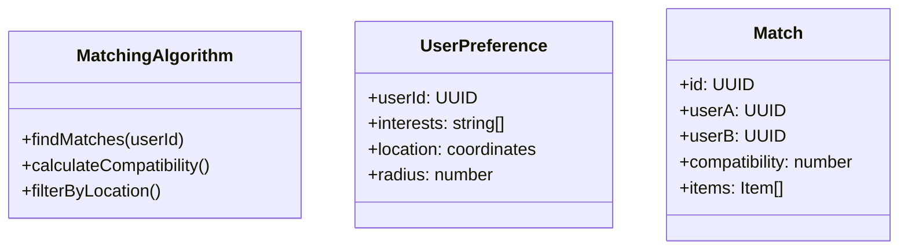

## 1. Sistema de Coincidencias (Match)

### Nivel 1: Contexto

**Propósito:** Mostrar cómo el sistema de coincidencias conecta necesidades con ofertas entre usuarios.

**Elementos principales:**

- Usuario A (busca un producto/servicio)
- Usuario B (ofrece un producto/servicio)
- Plataforma Truequealo (algoritmo de matching)
- Base de datos (perfiles, preferencias, historial)

**Descripción:**
Los usuarios interactúan con la plataforma. El sistema analiza sus necesidades y ofertas, aplicando algoritmos de coincidencia para sugerir intercambios potenciales.

### Nivel 2: Contenedores

**Elementos principales:**

- Frontend (SPA React) - interfaz de usuario
- Backend (API Express.js) - lógica de coincidencias
- Base de datos (PostgreSQL) - perfiles y preferencias
- Servicio de Geolocalización - para coincidencias por proximidad
- Servicio de Notificaciones - alertas de nuevas coincidencias

### Nivel 3: Componentes

**Frontend:**

- MatchingPage (página de coincidencias)
- MatchCard (visualización de coincidencias)
- MatchingService (consumo de API)

**Backend:**

- MatchingController (endpoints de coincidencias)
- MatchingAlgorithm (lógica de matching)
- UserPreferencesService (gestión de preferencias)
- MatchingRepository (acceso a datos)

### Nivel 4: Código

