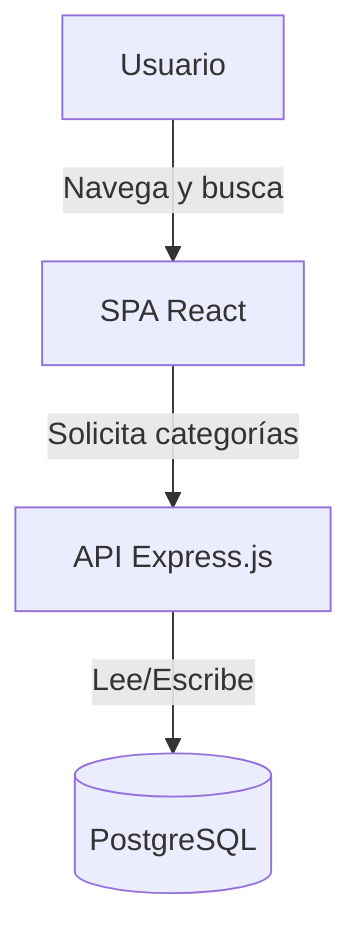
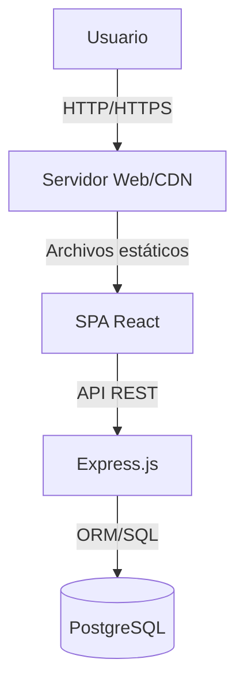
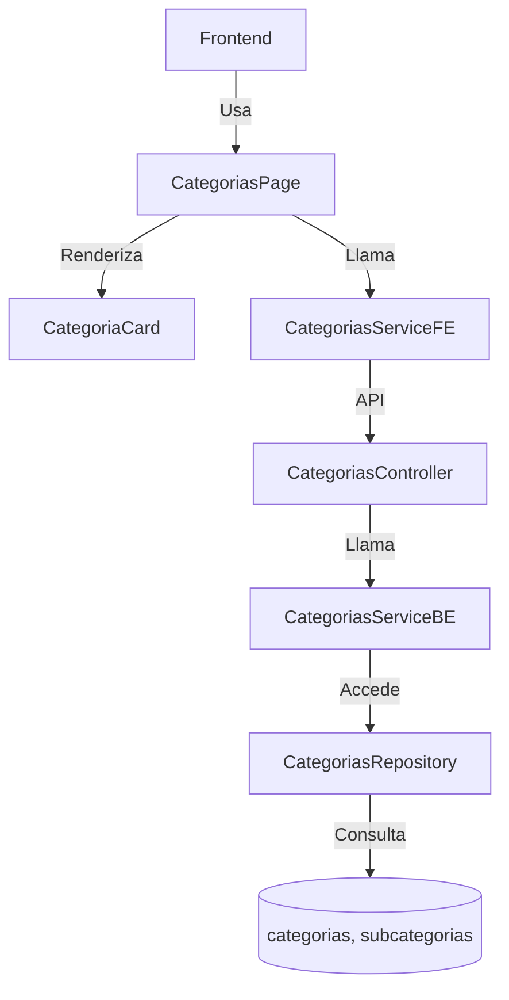
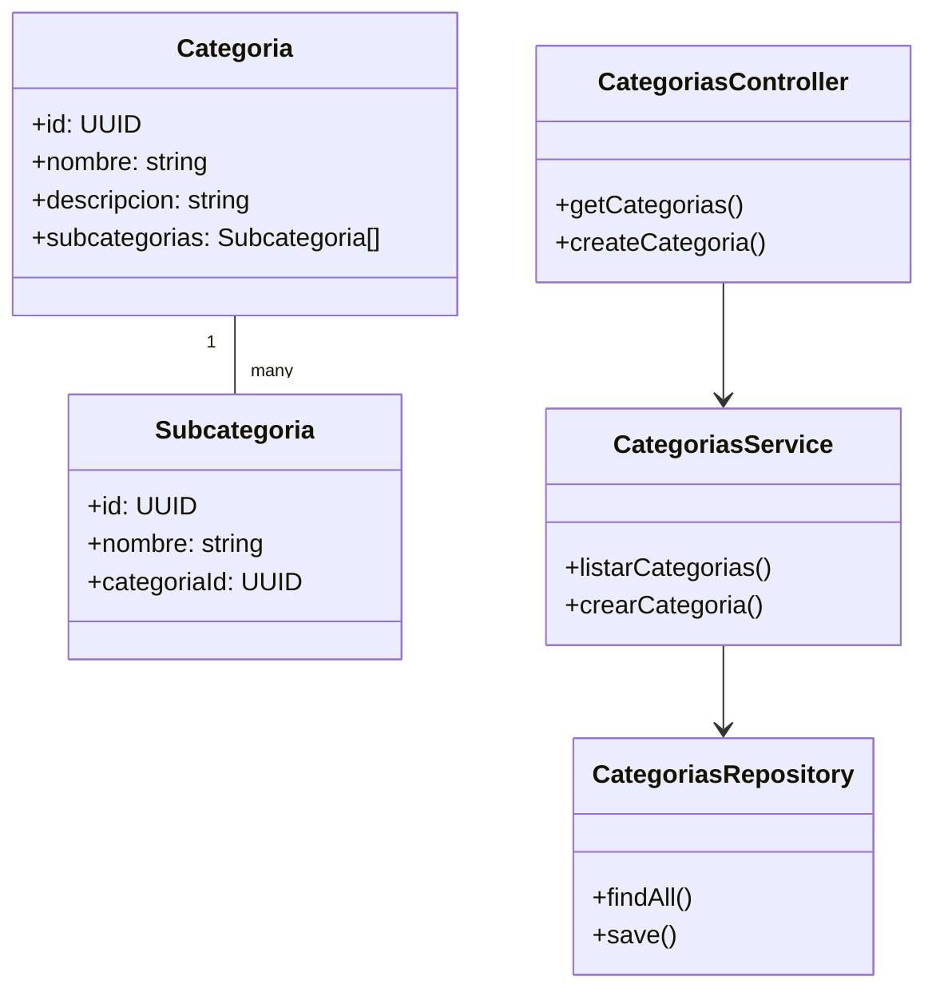

¡Perfecto! Vamos a crear el desglose de los 4 niveles del modelo C4 para la característica "Categorías de productos y servicios", basándonos en el diagrama de infraestructura y el diseño funcional.

### 1. Contexto (Nivel 1: System Context Diagram)

**Propósito:** Mostrar cómo la funcionalidad de categorías de productos y servicios se integra en el sistema global y cómo interactúan los usuarios y sistemas externos.

**Elementos principales:**

- Usuario (persona que busca/ofrece productos o servicios)
- Plataforma Truequealo (Frontend SPA + Backend API)
- Base de datos (PostgreSQL)
- Servicios externos (opcional, para futuras integraciones de catálogos)

**Descripción:**
El usuario accede a la plataforma Truequealo desde su dispositivo, navega por las categorías y subcategorías, y consulta la información almacenada en la base de datos a través de la API.

**Diagrama (pseudo-mermaid):**

---

### 2. Contenedores (Nivel 2: Container Diagram)

**Propósito:** Mostrar los principales contenedores de software implicados en la gestión de categorías.

**Elementos principales:**

- Frontend (SPA React)
- Backend (API REST Express.js)
- Base de datos (PostgreSQL)
- CDN/Servidor Web (sirve el frontend)
- Servicios de autenticación (si el acceso a categorías depende de login)

**Descripción:**
El frontend consume la API para mostrar y filtrar categorías. El backend expone endpoints para consultar, crear o modificar categorías. La base de datos almacena la estructura de categorías y subcategorías.

**Diagrama (pseudo-mermaid):**

---

### 3. Componentes (Nivel 3: Component Diagram)

**Propósito:** Detallar los componentes internos del backend y frontend relacionados con la gestión de categorías.

**Elementos principales:**

- Frontend:
  - CategoríasPage (página de exploración)
  - CategoríaCard (componente visual)
  - CategoríasService (servicio de consumo de API)
- Backend:
  - CategoríasController (gestiona endpoints)
  - CategoríasService (lógica de negocio)
  - CategoríasRepository (acceso a datos)
- Base de datos:
  - Tabla `categorias`
  - Tabla `subcategorias`

**Diagrama (pseudo-mermaid):**

---

### 4. Código (Nivel 4: Code/Classes Diagram)

**Propósito:** Mostrar la estructura de clases o módulos para la gestión de categorías.

**Ejemplo Backend (Express + ORM):**

---

## Resumen

- **Nivel 1 (Contexto):** Usuario interactúa con la plataforma para explorar categorías.
- **Nivel 2 (Contenedores):** Frontend, backend y base de datos colaboran para mostrar y gestionar categorías.
- **Nivel 3 (Componentes):** Componentes específicos en frontend y backend gestionan la lógica y visualización.
- **Nivel 4 (Código):** Clases/módulos para la gestión de categorías y subcategorías.

¿Quieres que prepare los diagramas en formato mermaid para cada nivel, o prefieres una descripción más detallada de algún nivel en particular?
