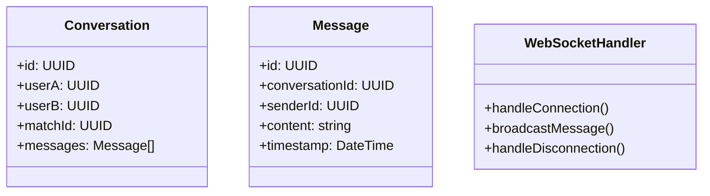

## 2. Negociación y Chat Integrado

### Nivel 1: Contexto

**Propósito:** Mostrar cómo los usuarios negocian y se comunican directamente para acordar intercambios.

**Elementos principales:**

- Usuario A y Usuario B (negociadores)
- Plataforma Truequealo (canal de comunicación)
- Servicio de Chat (mensajería en tiempo real)

**Descripción:**
Los usuarios establecen comunicación directa a través de la plataforma para discutir condiciones, detalles y acordar el intercambio.

### Nivel 2: Contenedores

**Elementos principales:**

- Frontend (SPA React) - interfaz de chat
- Backend (API Express.js) - gestión de conversaciones
- WebSocket Server - comunicación en tiempo real
- Base de datos (PostgreSQL) - historial de mensajes
- Servicio de Notificaciones - alertas de nuevos mensajes

### Nivel 3: Componentes

**Frontend:**

- ChatPage (página de conversación)
- MessageList (lista de mensajes)
- MessageInput (entrada de mensajes)
- ChatService (gestión de WebSocket)

**Backend:**

- ChatController (endpoints de chat)
- WebSocketHandler (gestión de conexiones)
- MessageService (lógica de mensajería)
- ChatRepository (persistencia de mensajes)

### Nivel 4: Código

