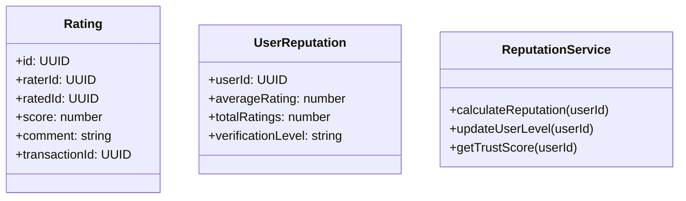

## 3. Reputación y Comentarios

### Nivel 1: Contexto

**Propósito:** Mostrar cómo los usuarios evalúan y construyen confianza mutua a través de calificaciones y comentarios.

**Elementos principales:**

- Usuario A (evalúa a Usuario B)
- Usuario B (recibe evaluación)
- Plataforma Truequealo (sistema de reputación)
- Base de datos (calificaciones y comentarios)

**Descripción:**
Después de un intercambio, los usuarios pueden calificarse mutuamente y dejar comentarios, contribuyendo al sistema de reputación de la plataforma.

### Nivel 2: Contenedores

**Elementos principales:**

- Frontend (SPA React) - interfaz de calificaciones
- Backend (API Express.js) - lógica de reputación
- Base de datos (PostgreSQL) - calificaciones y comentarios
- Servicio de Moderación - revisión de comentarios inapropiados
- Servicio de Notificaciones - alertas de nuevas evaluaciones

### Nivel 3: Componentes

**Frontend:**

- RatingPage (página de calificación)
- RatingForm (formulario de evaluación)
- UserProfile (perfil con reputación)
- RatingService (consumo de API)

**Backend:**

- RatingController (endpoints de calificaciones)
- ReputationService (cálculo de reputación)
- ModerationService (filtrado de contenido)
- RatingRepository (persistencia de evaluaciones)

### Nivel 4: Código

