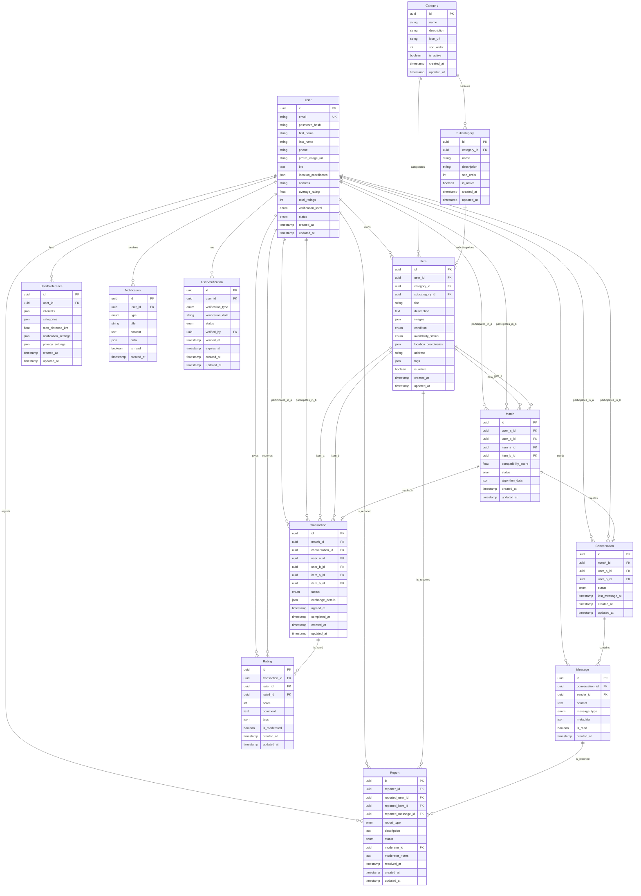

# Modelo de Datos - Truequealo

## Diagrama Entidad-Relación

Este diagrama representa el modelo de datos completo para la plataforma Truequealo, incluyendo todas las entidades principales y sus relaciones.

## Descripción de Entidades

### User
Entidad principal que representa a los usuarios de la plataforma. Incluye información personal, ubicación, sistema de reputación y niveles de verificación.

### Category y Subcategory
Sistema jerárquico de clasificación para productos y servicios. Permite organización clara y búsqueda eficiente.

### Item
Representa productos y servicios ofrecidos por los usuarios. Incluye información detallada, imágenes, ubicación y estado de disponibilidad.

### Match
Sistema inteligente de coincidencias que conecta usuarios con necesidades complementarias. Incluye puntuación de compatibilidad y datos del algoritmo.

### Conversation y Message
Sistema de chat integrado que permite la negociación directa entre usuarios. Soporte para diferentes tipos de mensajes y metadatos.

### Transaction
Registro de intercambios completados entre usuarios. Incluye detalles del intercambio y timestamps de las diferentes fases.

### Rating
Sistema de reputación que permite a los usuarios calificarse mutuamente después de completar transacciones.

### UserPreference
Configuración personalizada de cada usuario, incluyendo intereses, categorías preferidas, distancia máxima y configuraciones de privacidad.

### Report
Sistema de moderación que permite reportar contenido inapropiado o comportamiento indebido.

### Notification
Sistema de notificaciones para mantener a los usuarios informados sobre actividad relevante.

### UserVerification
Sistema de verificación de identidad con diferentes niveles de confianza y tipos de verificación.

## Características Técnicas

- **UUIDs**: Uso de identificadores únicos universales para todas las entidades principales
- **JSON Fields**: Campos flexibles para metadatos, configuraciones y datos complejos
- **Enums**: Tipos enumerados para estados y categorías predefinidas
- **Timestamps**: Auditoría completa con fechas de creación y actualización
- **Geolocalización**: Soporte para coordenadas geográficas en usuarios e items
- **Relaciones**: Definición clara de relaciones uno-a-muchos y muchos-a-muchos
